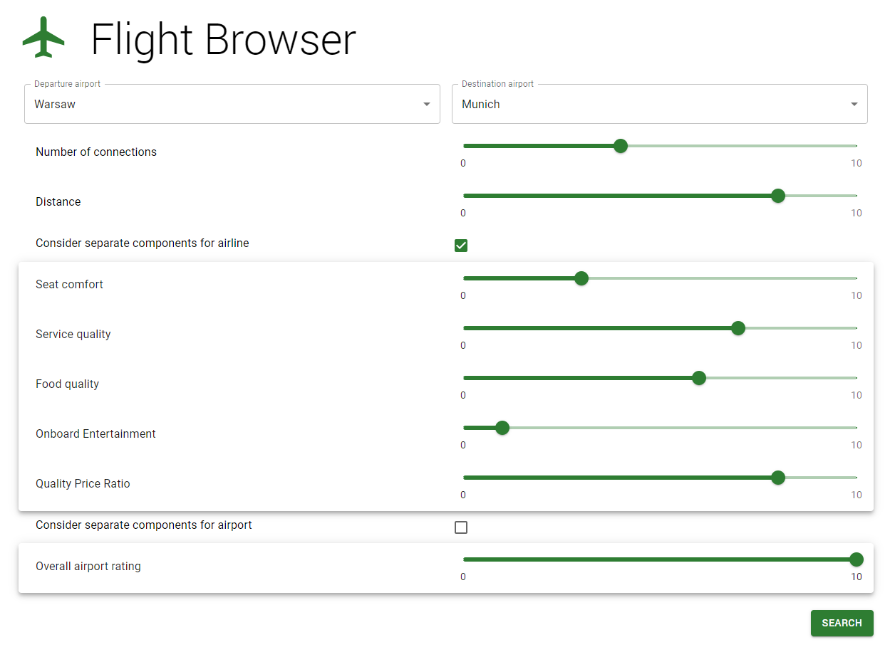
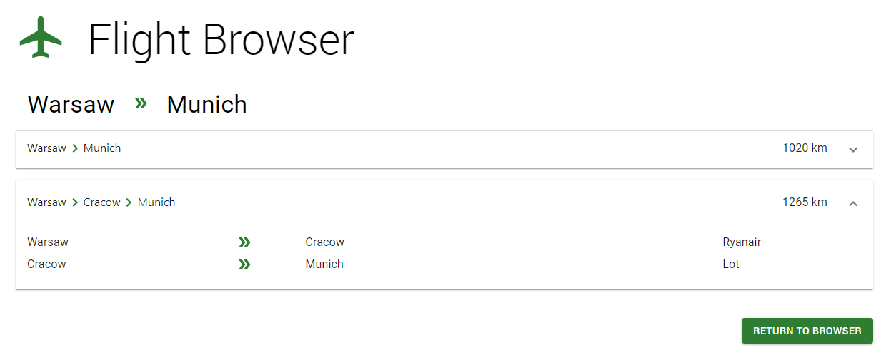

# Frontend

To run frontend you must have npm installed on your computer.

## Installation steps

Install dependencies
```
npm install
```

## Running the app

Start the frontend
```
npm start
```

The frontend should be now running on `http://127.0.0.1:3002`.

## Setting port

Default running port of frontend is 3002. It can be changed in file `.env`.

## Setting connection with backend

File `src/config.json` contains backend endpoints. It can be modified when the configuration of backend changes.

## Browsing flights

In the first step, user chooses departure and destination airports.
Next, number of connections to find must be defined.
In the next step component weights of connection rating must be provided.
Separate components of airlines and airports are optional and are not taken into account if checkboxes are not filled.



## Results view

In the results view user can see found connections. For each of them distance and transfer airports are given
as well as airline name for each section. In order to show ratings for transfer airports and for airlines user
can hover the mouse over their names.

